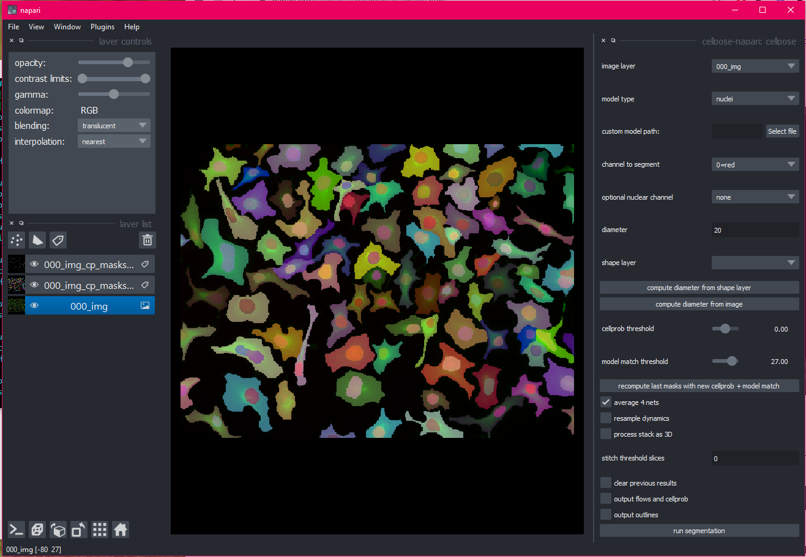

.. cellpose-napari documentation master file, created by
   sphinx-quickstart on Thu Oct  1 00:43:18 2015.
   You can adapt this file completely to your liking, but it should at least
   contain the root `toctree` directive.

Welcome to cellpose-napari's documentation!
===============================================================

cellpose-napari is a plugin to enable usage of cellpose in napari.

Please see cellpose `documentation`_ for more information on the 
algorithm and the settings.

.. _documentation: http://www.readthedocs.cellpose.io

.. toctree::
   :maxdepth: 3
   :caption Basics:   
   installation
   running
   settings
