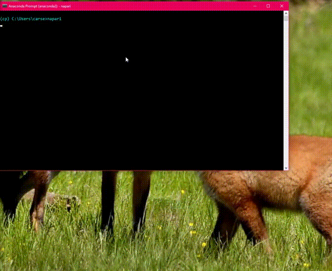
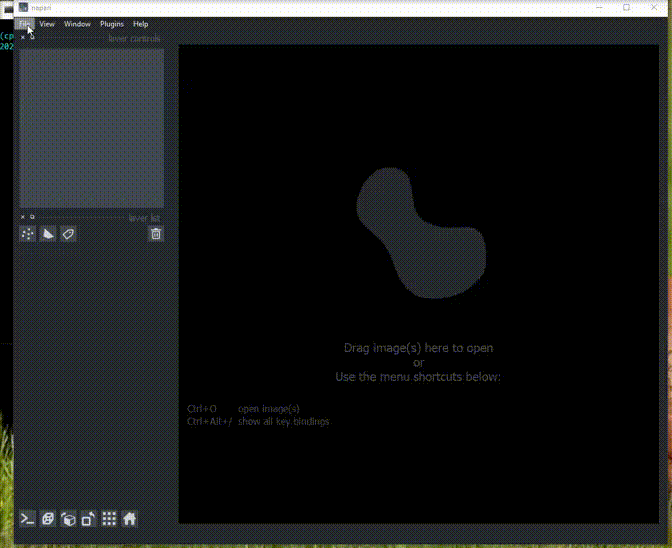
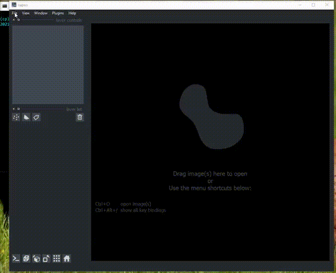
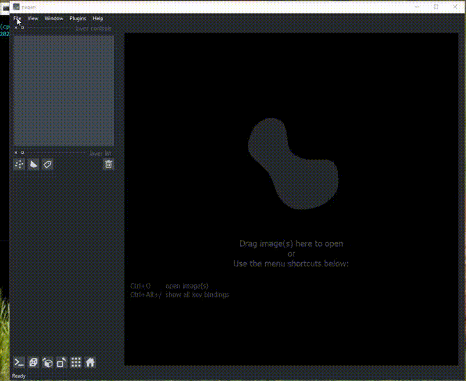

Running plugin
-------------------------------

You can drag and drop a variety of images into napari. 
You can also open a folder of images to process together 
(or sequentially). See napari `image`_ documentation for more 
advanced image loading.

2D images
~~~~~~~~~~~~~~~~~~~~~~~~~~

Here is an example of the plugin running on the 2D sample image.

Batch processing in 2D
~~~~~~~~~~~~~~~~~~~~~~~~~~

Cellpose will process all images in an opened folder with the same settings 
and return masks for each image with the name ``folder_name_fileid``. You can 
export all the images in the napari File menu.

Here is an example of the plugin running on a folder of 2D data.

3D segmentation
~~~~~~~~~~~~~~~~~~~~~~~~~~

Cellpose can segment 3D and 4D stacks. If there is a channel 
axis, specify it by labelling it with 'c'.

To run 3D processing, check ``process stack as 3D``.

If the 3D segmentation is not working well and there is inhomogeneity in Z, try stitching 
masks using the ``stitch threshold slices`` option
instead of checking ``process stack as 3D``. In this setting, 
cellpose will create masks in 2D on each XY slice and then stitch them across 
slices if the IoU between the mask on the current slice and the next slice is 
greater than or equal to the ``stitch threshold slices``. 

Here is an example of the plugin running on the 3D sample image.

Time segmentation
~~~~~~~~~~~~~~~~~~~~~~~~~~~

Stitching can also be applied in time by setting ``stitch threshold slices``>0.

Here is an example of the plugin running on cell tracking challenge data.

.. _image: https://napari.org/tutorials/fundamentals/image.html
.. _stitch_threshold: http://cellpose.readthedocs.io/settings.html#d-settings
